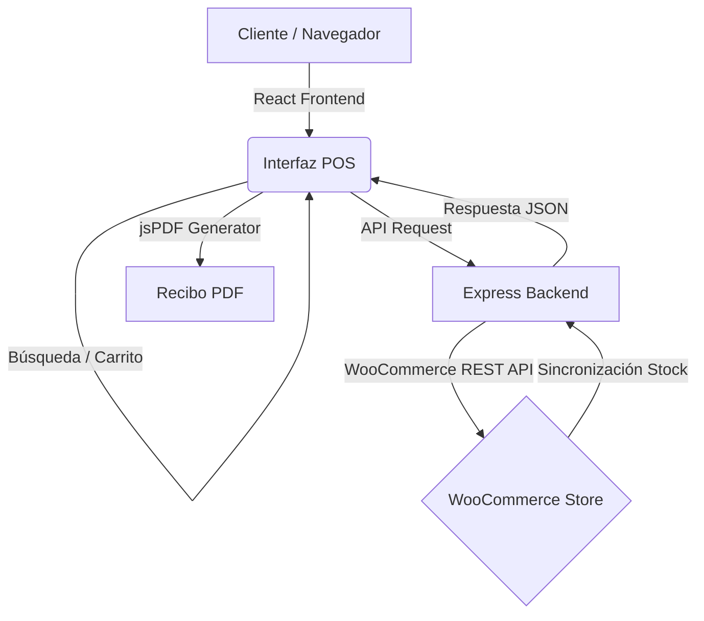

<div align="center">

```text
      ╔═╗╔═╗╔═╗  ╔═╗╦═╗╔═╗╔╦╗╦╦ ╦╔╦╗
      ╠═╝║ ║╚═╗  ╠═╝╠╦╝║╣  ║║║║║ ║║║║
      ╩  ╚═╝╚═╝  ╩  ╩╚═╚═╝ ╩ ╩╩╚═╝╩ ╩
  v1.0.0 — WooCommerce POS Solution
```

**Interfaz de punto de venta premium conectada directamente a tu tienda WooCommerce.**

[Características](#-características) • [Instalación](#-instalación) • [Arquitectura](#-arquitectura) • [Tecnologías](#-tecnologias)

</div>

---

## ⚡ ¿Qué es POS PREMIUM?

`POS PREMIUM` es una solución completa de punto de venta (Point of Sale) diseñada para modernizar la gestión de ventas físicas integradas con WooCommerce. Permite a los negocios procesar pedidos, gestionar inventario en tiempo real y emitir recibos profesionales de forma instantánea.

**Sincronización total. Interfaz ultra-rápida. Control absoluto.**

## ✨ Características

- 🛒 **Gestión de Carrito:** Interfaz intuitiva para añadir, modificar y eliminar productos del pedido.
- 📊 **Dashboard de Ventas:** Visualización de métricas clave y rendimiento mediante gráficos dinámicos.
- 📑 **Generación de Recibos:** Creación automática de facturas en PDF con `jsPDF` listas para imprimir.
- 🔄 **Sincronización WooCommerce:** Conexión bidireccional mediante REST API para stock y pedidos.
- 🎨 **Interfaz de Cristal:** Diseño moderno basado en "Glassmorphism" con Bootstrap Premium.
- 📱 **Responsive Design:** Optimizado para tablets y pantallas táctiles de mostrador.

---

## 🚀 Instalación (Rápida)

### 1. Clonar el repositorio
```bash
git clone https://github.com/Nitram2704/POS.git
cd POS
```

### 2. Configurar el Backend
```bash
cd backend
npm install
```
Crea un archivo `.env` en la carpeta `backend`:
```env
PORT=5000
WC_URL=https://tu-tienda.com
WC_CONSUMER_KEY=ck_tu_key
WC_CONSUMER_SECRET=cs_tu_secret
```
Inicia el servidor:
```bash
npm run dev
```

### 3. Configurar el Frontend
```bash
cd ../frontend
npm install
npm start
```

---

## 🏗️ Arquitectura del Sistema



El sistema utiliza una arquitectura **desacoplada**:
1. **Frontend:** Gestiona la experiencia del usuario y la lógica del carrito en el cliente.
2. **Backend:** Actúa como un middleware seguro para comunicarse con la API de WooCommerce.
3. **WooCommerce:** Funciona como la base de datos centralizada de productos y pedidos.

---

## 🛠️ Tecnologías

| Frontend | Backend | Herramientas |
| :--- | :--- | :--- |
| **React 19** | **Node.js** | Git / GitHub |
| **Bootstrap 5** | **Express.js** | Postman |
| **Recharts** | **WooCommerce API** | PDF Autotable |
| **Axios** | **Dotenv** | React Icons |

---

<div align="center">
  <i>Diseñado para negocios modernos. Potenciado por WooCommerce.</i>
</div>
